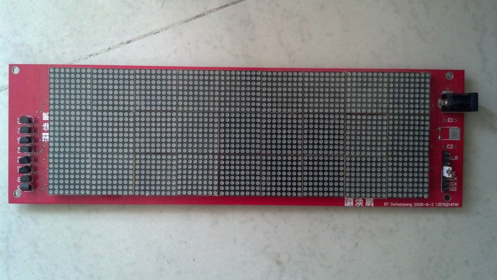
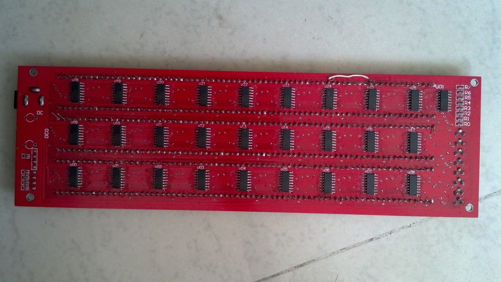
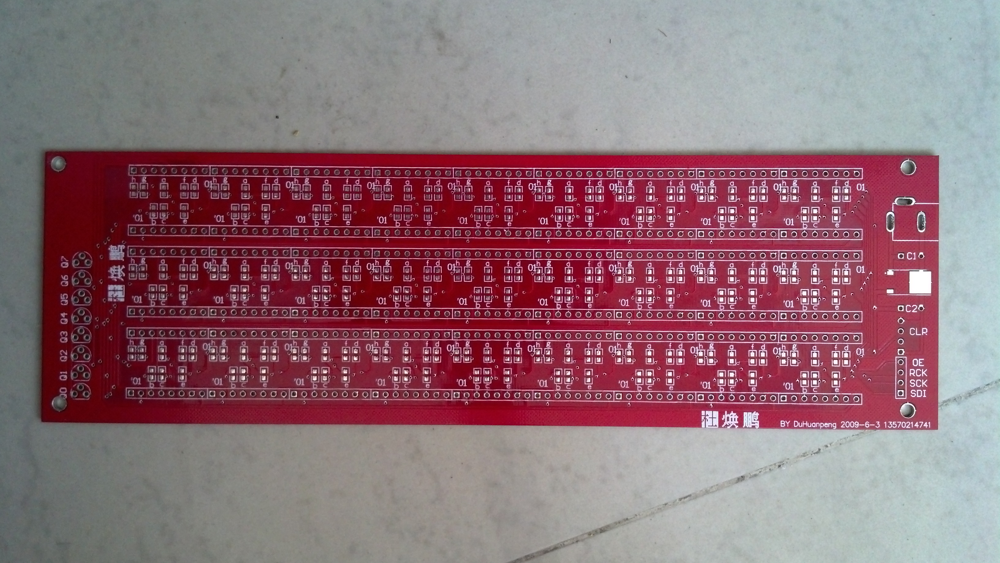
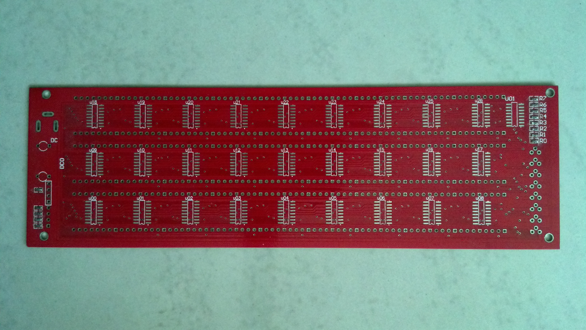

### overview






### hardware
here is the [pcb](/hardware/led-matirx-pcb.zip) files in protel99se format.

### software
software was lost, but here is a simple example to driver the matrix.

```
char buf[8][27+1];
buf[0][27] = 0x01;
buf[1][27] = 0x02;
  ...
buf[7][27] = 0x80;

for(i=0;;i++){

  for(j=0;j<sizeof(buf[0]);j++){
    writeb(74595, buf[i][j]);
  }
  flush(74595);
  delay(n);

  i %= 8;
}
```
